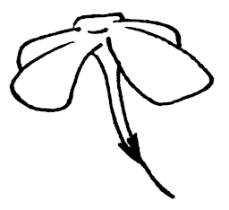

# Catalyst



[](https://github.com/kosatnkn/catalyst/actions/workflows/ci.yml)
[](https://github.com/kosatnkn/catalyst/actions/workflows/codeql-analysis.yml)
[](https://coveralls.io/github/kosatnkn/catalyst?branch=master)


[](https://pkg.go.dev/github.com/kosatnkn/catalyst/v2)
[](https://goreportcard.com/report/github.com/kosatnkn/catalyst)

`Catalyst` started out as a microservice base that can be used to create REST APIs. It contains many features that are essential, such as.
- Configurability
- A basic dependency injection mechanism
- HTTP request, response cycle handling
- Structure and field validations
- Error handling
- Logging
- Database resource management
- Application metrics

Written in **Go** using the **Clean Architecture** paradigm it offers clean separation between business (domain) logic and facilitation logic.

## Creating a New Project Using Catalyst

A new project can be created in one of two ways.

### Use Cauldron

The easiest way to create a project using `Catalyst` as the base is to use `Cauldron`.

`Cauldron` is a project generation tool that creates new projects using `Catalyst` as the base.

More information about `Cauldron` can be found [here](https://github.com/kosatnkn/cauldron)

Begin by installing `Cauldron`.
```bash
go get github.com/kosatnkn/cauldron
```

**Command**
```bash
cauldron -n Sample -s github.com/username [-t v1.0.0]
```
```bash
cauldron --name Sample --namespace github.com/username [--tag v1.0.0]
```

**Input Parameters**
- `-n --name` Project name (ex: Sample). The name will be converted to lowercase to be used in module path.
- `-s --namespace` Namespace for the project (ex: github.com/username)
- `-t --tag` Release version of `Catalyst` to be used. The latest version will be used if `-t` is not provided
- `-h --help` Show help message

This will create a new project with **go.mod** module path of `github.com/username/sample`

`Cauldron` will do a `git init` on the newly created project but you will have to stage all the files and do the first commit yourself.
```bash
git add .

git commit -m "first commit"
```

### Cloning

This is the work intensive approach.

Clone `Catalyst`
```bash
git clone https://github.com/kosatnkn/catalyst.git <new_project_name>
```

Remove `.git`
```bash
cd <new_project_name>

rm -rf .git
```

Change import paths
> NOTE: Since `Catalyst` uses go mod the the newly created application will still work. But all the import paths would be as in `Catalyst` base project which is not what you will want.
- First change the module name in the `go.mod` file to a module name of your choice
- Then do a `Find & Replace` in the entire project to update all the import paths
- You may also need to change the splash text in `app/splash/styles.go`
- Now run and see whether the project compiles and run properly
- If so you can do a `git init` to the project

## Configurations
Configuration files for a `Catalyst` project can be found in `configs` directory.

Initially you will have a set of config files with the extension of `.yaml.example`. You can create `.yaml` configuration files using these **example** files as a template.

## The Sample Set
We have included a sample set of endpoints and their corresponding controller and domain logic by default.

This is to make it easier for you to follow through and understand how Catalyst handles the request response cycle for a given request.

The sample set will cover all basic CRUD operations that a REST API will normally need.

There is also an `openapi.yaml` file in `doc/api` directory that corresponds to the set of **Sample APIs** that are implemented.

## Channels
In the context of `Catalyst` we use a concept called `Communication Channels` (simply channels) to define ways in which you can communicate with the microservice (do not confuse these with `channels` in `Go`, which is an entirely different thing).

A `channel` in `Catalyst` is a package inside the **channels** directory. This package consists of all the logic needed to handle communication with the outside world.

Out of the box, `Catalyst` contain two such channels.
- `http` (to handle REST web requests)
- `metrics` (to expose application metrics)

What makes `Catalyst` a REST API is this `http` package which handles the complete lifecycle of REST web requests.
### `http` Channel

REST API is implemented in this channel.

Following is the request, response cycle executed when a request comes to a REST endpoint.
```text
                               + ------- +           + -------- +
                               | REQUEST |           | RESPONSE |
                               + ------- +           + -------- +
                                   ||                     /\
                                   \/                     ||
                            + ------------ +              ||
                            |  Middleware  |              ||
                            + ------------ +              ||
                                   ||                     ||
                                   \/                     ||
                            + ------------ +              ||  
                            |    Router    |              ||    
                            + ------------ +              ||  
                                       ||                 ||
                                       ||                 ||
                                       ||   + --------------------------- +
                                       ||   | Transformer | Error Handler |
                                       ||   + --------------------------- +
                                       ||    /\
                                       \/    ||
    + -------------------- +  =>  + -------------- +  
    | Unpacker | Validator |      |   Controller   |      
    + -------------------- +  <=  + -------------- +    
                                      ||       /\
                                      \/       ||
                                  + -------------- +
                                  |    Use Case    |
                                  + -------------- +
                                      ||       /\
                                      \/       ||
                          _____________________________________
                              + ---------- +    + ------- +
                              | Repository |    | Service |
                              + ---------- +    + ------- +
                                ||    /\          ||  /\
                                \/    ||          \/  ||
                              + ---------- +    + ------- +
                              |  Database  |    |   APIs  |
                              + ---------- +    + ------- +
```

### `metrics` Channel

Likewise the `metrics` channel exposes an endpoint to let `Prometheus` scrape application metrics.

### Extending the Microservice

You can add other `communication channels` to leverage a project based on `Catalyst`.

For an example a `stream` package can be added to `channels` to communicate with a streaming platform like `Kafka`. Or an `mqtt` package can be added to communicate with `IoT` devices.

## View GoDoc Locally
```bash
godoc -http=:6060 -v
```

Navigate to [http://localhost:6060/pkg/github.com/kosatnkn/catalyst/v2](http://localhost:6060/pkg/github.com/kosatnkn/catalyst/v2)


## Using Go mod

Go mod is used as the dependency management mechanism. Visit [here](https://github.com/golang/go/wiki/Modules) for more details.

Some commonly used go mod commands for quick reference.

Use go mod in projects that are within the `GOPATH`
```bash
export GO111MODULE=on
```

Initialize go mod
```bash
go mod init github.com/my/repo
```

View final versions that will be used in a build for all direct and indirect dependencies
```bash
go list -m all
```
View available minor and patch upgrades for all direct and indirect dependencies
```bash
go list -u -m all
```
Update all direct and indirect dependencies to latest minor or patch upgrades (pre-releases are ignored)
```bash
go get -u or go get -u=patch
```
Build or test all packages in the module when run from the module root directory
```bash
go build ./... or go test ./...
```
Prune any no-longer-needed dependencies from go.mod and add any dependencies needed for other combinations of OS, architecture, and build tags
```bash
go mod tidy
```
Optional step to create a vendor directory
```bash
go mod vendor
```
ProjectOne
## Testing

To run test and output coverage report
```bash
go test -covermode=count -coverprofile=cover.out ./...
```

To get coverage as a percentage of overall codebase use `-coverpkg=./...`
```bash
go test -covermode=count -coverpkg=./... -coverprofile=cover.out ./...
```

## Docker

Catalyst provides a basic multistage Dockerfile so you have a starting point for creating Docker images.

```bash
docker build -t <tag_name>:<tag_version> .
```

> NOTE: Do not forget the tailing `.` that indicates the current directory

**Example**
```bash
docker build -t kosatnkn/catalyst:1.0.0 .
```

You can use it as follows
```bash
docker run -it --rm --name catalyst -p 3000:3000 -p 3001:3001 kosatnkn/catalyst:1.0.0
```

Do both in one go
```bash
docker build -t kosatnkn/catalyst:1.0.0 . && docker run -it --rm --name catalyst -p 3000:3000 -p 3001:3001 kosatnkn/catalyst:1.0.0
```

## Wiki

Wiki pages on technical aspects of the project can be found [here](https://github.com/kosatnkn/catalyst/wiki)

> NOTE: Wiki is currently being updated.
